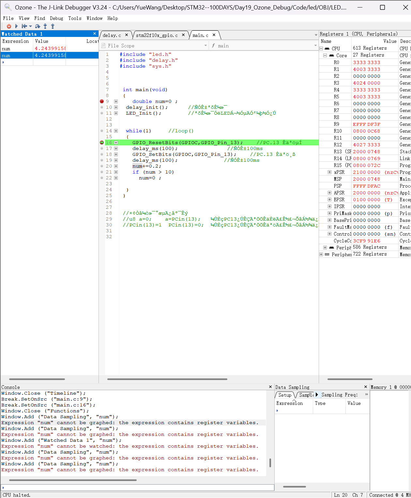
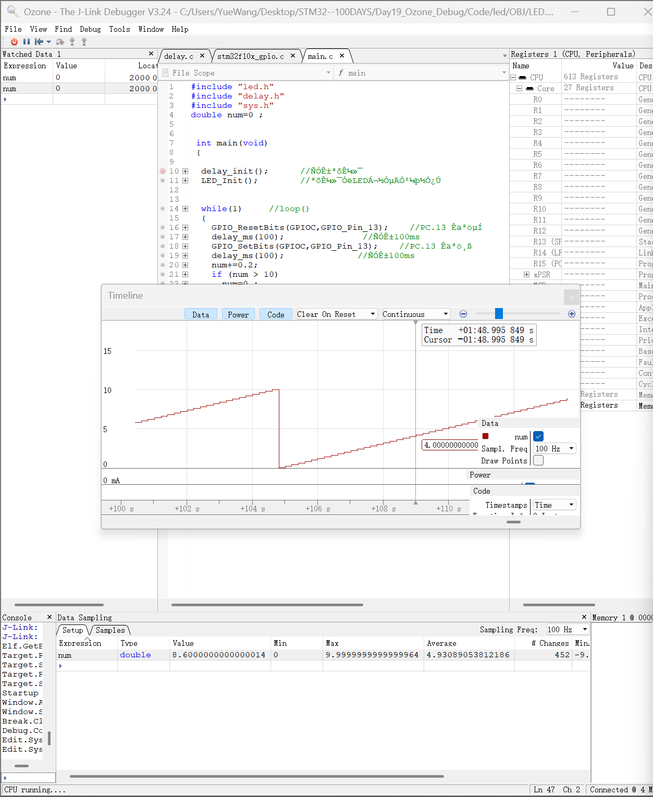

# Day 19：Ozone 可视化调试与变量实时监测

## 今日学习目标

- 安装并配置 J-Link 调试环境。
- 使用 SEGGER Ozone 连接 STM32F103C8。
- 在 Keil 中生成带调试信息的 `LED.axf` 文件。
- 在 Ozone 中加载程序、查看源码并在线调试。
- 使用 Watched Data 实时观察变量。
- 使用 Data Sampling 采样变量，并在 Timeline 中绘制曲线。
- 理解局部变量、全局变量、编译优化与调试可见性的关系。

## 工程说明

本项目基于 STM32F103C8 和标准外设库。程序控制 PC13 LED 周期性亮灭，同时让全局变量 `num` 每轮增加 `0.2`；当 `num` 大于 `10` 时重新清零。Ozone 以 100 Hz 采样该变量，因此 Timeline 中会出现周期性上升并回零的锯齿形曲线。

当前调试配置：

| 项目 | 配置 |
| --- | --- |
| MCU | STM32F103C8 |
| 调试器 | J-Link |
| 目标接口 | SWD |
| SWD 速度 | 4 MHz |
| Ozone | V3.24 |
| Keil 工程 | `Code/LED/LED.uvprojx` |
| Ozone 工程 | `Code/LED/led_debug.jdebug` |
| Keil 输出文件 | `Code/LED/OBJ/LED.axf` |

## 核心测试代码

`num` 被定义在所有函数之外，因此它是全局变量：

```c
double num = 0;

int main(void)
{
    delay_init();
    LED_Init();

    while (1)
    {
        GPIO_ResetBits(GPIOC, GPIO_Pin_13);
        delay_ms(100);
        GPIO_SetBits(GPIOC, GPIO_Pin_13);
        delay_ms(100);

        num += 0.2;
        if (num > 10)
        {
            num = 0;
        }
    }
}
```

仓库中的 `main.c` 保留了本次实际实验代码，没有为了文档展示而改写控制逻辑。

## J-Link 安装与配置

本次学习过程使用 J-Link V6.46 和 Ozone V3.24，主要步骤如下：

1. 安装与当前调试器兼容的 SEGGER J-Link Software。
2. 确认 J-Link USB 驱动安装完成。
3. 如果电脑中存在多个 J-Link 版本，确认 Keil 与 Ozone 使用兼容的 `JLinkARM.dll`。
4. 使用 SWD 连接 STM32：

```text
J-Link SWDIO -> STM32 SWDIO
J-Link SWCLK -> STM32 SWCLK
J-Link GND   -> STM32 GND
J-Link VTref -> STM32 3.3V
```

5. 连接开发板后，在 Ozone 中选择：

```text
Device: STM32F103C8
Host Interface: USB
Target Interface: SWD
Target Interface Speed: 4 MHz
```

不同版本的 J-Link 软件不应随意混用 DLL。出现驱动或版本冲突时，应先备份原文件，并优先使用 SEGGER 安装程序提供的兼容组件。

## 在 Keil 中生成 AXF 文件

Ozone 需要加载带符号和调试信息的可执行文件。本工程的 Keil 配置已经确认：

- `CreateExecutable = 1`
- `DebugInformation = 1`
- 输出目录为 `.\OBJ\`
- 输出名称为 `LED`

操作步骤：

1. 使用 Keil 打开：

```text
Code/LED/LED.uvprojx
```

2. 执行 Build。
3. 编译成功后生成：

```text
Code/LED/OBJ/LED.axf
```

整理前的最近一次 Keil 构建结果为 `0 Error(s), 0 Warning(s)`。

`OBJ` 属于可重新生成的编译目录，因此没有放入 GitHub。克隆项目后需要先在 Keil 中重新 Build，再启动 Ozone。

## Ozone 加载工程的方法

项目已经保留可复用的 Ozone 工程文件：

```text
Code/LED/led_debug.jdebug
```

该文件配置了 STM32F103C8、USB、SWD、4 MHz，并通过相对路径加载：

```text
$(ProjectDir)/OBJ/LED.axf
```

推荐流程：

1. 先在 Keil 中 Build，确保 `OBJ/LED.axf` 已生成。
2. 用 Ozone 打开 `led_debug.jdebug`。
3. 连接 J-Link 和目标板。
4. 执行 Download & Reset Program。
5. 点击 Run，让 CPU 继续运行。
6. 在 Watched Data 中添加表达式 `num`。
7. 在 Data Sampling 中添加 `num`。
8. 打开 Timeline，并勾选 `num` 曲线。

## 变量无法绘图的问题

### 现象

最初把 `num` 定义在 `main()` 内部时，Ozone 可以在部分暂停位置看到它，但添加到 Data Sampling 或 Timeline 时出现：

```text
Expression "num" cannot be graphed:
the expression contains register variables.
```

### 原因

局部变量的生命周期和作用域受函数控制。编译器还可能把局部变量放入 CPU 寄存器，或者在优化时改变、合并甚至删除它。此时变量没有一个能被 Ozone 持续采样的稳定 RAM 地址。

### 本次解决方法

把 `num` 移到函数外，定义成全局变量：

```c
double num = 0;
```

全局变量通常具有固定的存储地址，AXF 调试符号可以把变量名映射到该地址，Ozone 因而能够连续读取并绘图。

如果某个只用于调试的变量仍被优化掉，可以进一步评估是否需要：

```c
volatile double num = 0;
```

不过 `volatile` 会改变编译器对变量访问的优化方式，不应为了“看起来方便”而无条件添加。本次最终代码保持普通全局变量。

## 全局变量与局部变量

| 对比项 | 全局变量 | 局部变量 |
| --- | --- | --- |
| 定义位置 | 所有函数之外 | 函数或代码块内部 |
| 作用域 | 从定义处到文件末尾，可通过 `extern` 跨文件访问 | 当前函数或代码块 |
| 生命周期 | 程序整个运行期间 | 进入代码块后创建，离开后失效 |
| 常见存储位置 | RAM 的静态存储区 | 栈或 CPU 寄存器 |
| 连续采样 | 通常较稳定 | 可能因作用域和优化而无法持续采样 |

局部变量并不是绝对无法调试。只要调试信息完整、变量仍处于有效作用域且没有被优化掉，调试器也可能读取它。本次问题的关键是该局部变量被表示为寄存器变量，不适合 Ozone 的连续数据采样。

## 调试器读取变量的原理

数据链可以概括为：

```text
C 源码变量名
-> Keil 编译并生成 AXF 调试符号
-> Ozone 从 AXF 获取变量类型和地址
-> J-Link 通过 SWD 访问 STM32 内存
-> Ozone 把读取到的二进制数据解释成 double
-> Watched Data 显示数值
-> Data Sampling 记录样本
-> Timeline 绘制曲线
```

AXF 不只是可下载的机器码，还包含符号表、源码行号、变量类型和地址等调试信息。没有调试信息时，即使程序能运行，Ozone 也很难把内存地址还原为可读的变量名。

## Data Sampling 与 Timeline

### Watched Data

Watched Data 适合查看变量在当前时刻的值。程序暂停时可以精确检查状态，运行时也可以配合调试器能力进行更新。

### Data Sampling

Data Sampling 会按设定频率持续读取变量并保存样本。本工程的 Ozone 配置为：

```text
Sampling Frequency: 100 Hz
```

采样表可以显示当前值、最小值、最大值、平均值和变化次数。

### Timeline

Timeline 将采样数据按时间绘制成曲线。本实验中：

```text
num 每约 200 ms 增加 0.2
num > 10 时清零
```

所以曲线持续上升，到达上限后快速回到 0，再开始下一轮。观察结果与程序逻辑一致。

## 实验截图

### Ozone 连接成功


### Watch 变量



### Timeline 曲线



## GitHub 目录结构

```text
Day19_Ozone_Debug/
├── .gitignore
├── Code/
│   └── LED/
│       ├── CORE/
│       ├── HARDWARE/
│       │   └── LED/
│       ├── FWLib/
│       │   ├── inc/
│       │   └── src/
│       ├── SYSTEM/
│       │   ├── delay/
│       │   ├── sys/
│       │   └── usart/
│       ├── LED.uvoptx
│       ├── LED.uvprojx
│       ├── USER/
│       │   ├── main.c
│       │   └── ...
│       ├── led_debug.jdebug
│       └── README.TXT
├── Images/
│   ├── 01_Ozone_Connected.png
│   ├── 02_Watch_Variable.png
│   └── 03_Timeline_Curve.png
└── README.md
```

## 今日总结

今天完成了从“程序能够运行”到“程序状态能够被观察和分析”的升级。通过 Keil 生成带调试符号的 AXF 文件，再由 Ozone、J-Link 和 SWD 读取 STM32 内存，可以实时查看变量、记录数据并绘制 Timeline 曲线。

这次还通过 `num` 无法绘图的问题，理解了变量作用域、寄存器分配、编译优化和调试符号之间的关系。后续调试电机速度闭环和 PID 时，可以用同样的方法同时观察 `speed`、`error`、`a_m` 等变量，比只看 OLED 上的瞬时数字更适合分析动态响应。
