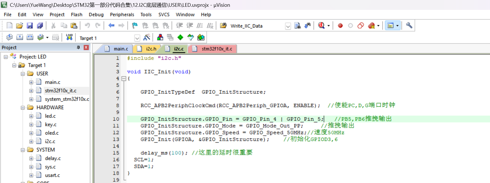
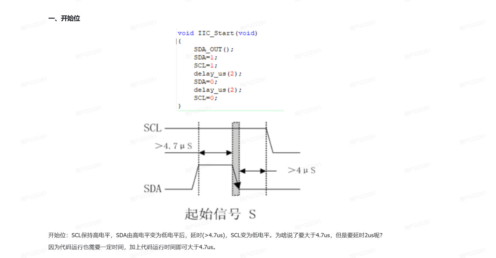

# Day 21：I2C 软件模拟通信

本项目记录 STM32 100 天学习计划的 Day21 实验。工程基于 STM32F103C8 和 STM32 标准外设库，使用 GPIO 模拟 I2C 时序，重点学习 START、STOP、ACK、NACK、字节发送、字节接收以及 SDA 输入输出方向切换。

## 工程说明

- MCU：STM32F103C8
- 开发环境：Keil MDK-ARM
- 固件库：STM32F10x Standard Peripheral Library
- Keil 工程入口：`Code/LED.uvprojx`
- SCL：PA4
- SDA：PA5
- 实现方式：GPIO 软件模拟 I2C

当前 `main.c` 用于初始化 LED、OLED 和软件 I2C，并保留课程中的变量观察代码。I2C 底层时序实现在 `Code/HARDWARE/I2C/i2c.c` 中。

## 目录结构

```text
Day21_I2C_BitBang_Communication_GitHub/
├── Code/
│   ├── LED.uvprojx
│   ├── LED.uvoptx
│   ├── USER/
│   ├── HARDWARE/
│   │   ├── I2C/
│   │   ├── KEY/
│   │   ├── LED/
│   │   └── OLED/
│   ├── SYSTEM/
│   │   ├── delay/
│   │   ├── sys/
│   │   └── usart/
│   ├── CORE/
│   └── FWLib/
├── Images/
├── README.md
└── .gitignore
```

`CORE`、`FWLib`、启动文件、系统模块和 Keil 工程配置均已保留。下载后可直接打开 `Code/LED.uvprojx` 重新 Build。

## 今日学习目标

1. 理解 I2C 的 SCL 与 SDA 两根信号线。
2. 理解 START 和 STOP 的产生条件。
3. 理解 ACK、NACK 及主从机应答过程。
4. 使用 GPIO 模拟 I2C 时序。
5. 理解 SDA 在发送和接收阶段为何需要切换输入输出模式。
6. 使用移位和按位运算完成一个字节的发送与接收。

## I2C 基本时序

### START

当 SCL 保持高电平时，SDA 从高电平变为低电平，表示一次通信开始。

```c
void IIC_Start(void)
{
    SDA_OUT();
    SDA = 1;
    SCL = 1;
    delay_us(2);
    SDA = 0;
    delay_us(2);
    SCL = 0;
}
```

### STOP

当 SCL 保持高电平时，SDA 从低电平变为高电平，表示一次通信结束。

```c
void IIC_Stop(void)
{
    SDA_OUT();
    SCL = 0;
    SDA = 0;
    delay_us(2);
    SCL = 1;
    SDA = 1;
    delay_us(2);
}
```

## SDA 输入输出切换

主机发送地址或数据时，SDA 由 STM32 驱动，因此配置为输出；主机读取从机应答或数据时，需要释放 SDA 并将其配置为输入。

```c
#define SDA_IN()  {GPIOA->CRL &= 0XFF0FFFFF; GPIOA->CRL |= (u32)8 << 20;}
#define SDA_OUT() {GPIOA->CRL &= 0XFF0FFFFF; GPIOA->CRL |= (u32)3 << 20;}
```

本课程代码使用推挽输出演示软件时序。标准 I2C 总线通常使用开漏输出并配合上拉电阻；连接真实 I2C 器件时，应结合模块电路和器件手册确认电气配置。

## 字节发送

I2C 按高位在前的顺序发送一个字节。代码通过 `0x80` 取出最高位，再左移一位，使下一位移动到最高位。

```c
m = da & 0x80;
SDA = (m == 0x80) ? 1 : 0;
da <<= 1;
```

循环执行 8 次后，bit7 到 bit0 被依次发送。

## 字节接收

接收时先左移，为新读取的一位腾出最低位：

```c
receive <<= 1;
if (READ_SDA)
{
    receive++;
}
```

读取 8 次后组成一个完整字节。参数 `ack` 决定接收结束后发送 ACK 还是 NACK。

## ACK 与超时

`IIC_Wait_Ack()` 将 SDA 切换为输入并等待从机拉低 SDA。代码带有简单的循环次数超时，等待过久时调用 `IIC_Stop()` 并返回错误。

```c
while (READ_SDA)
{
    Ack_Error_Time++;
    if (Ack_Error_Time > 250)
    {
        IIC_Stop();
        return 1;
    }
}
```

## 位运算复习

| 运算符 | 作用 |
|---|---|
| `&` | 按位与，用于保留或检测指定 bit |
| `|` | 按位或，用于将指定 bit 置 1 |
| `<<` | 左移 |
| `>>` | 右移 |
| `~` | 按位取反 |
| `^` | 按位异或 |

STM32 的 GPIO 模式切换和寄存器控制大量使用这些位运算。

## 学习截图

### Keil 中的软件 I2C 代码



### START 条件与代码对应关系



## 打开与编译

1. 安装 Keil MDK-ARM，并确保 ARM Compiler 5 工具链可用。
2. 打开 `Code/LED.uvprojx`。
3. 选择 `Target 1`。
4. 执行 Build。

工程将编译产物写入 `Code/OBJ/`，列表文件写入 `Code/Listings/`。这些目录由 `.gitignore` 排除，不应提交到 GitHub。

## 当前代码说明

课程源码保持原样，没有为整理目录修改控制逻辑。`main.c` 中的以下两行会产生整数转换相关警告：

```c
u8 a = -1;
char aa = -1;
```

它们属于当天的变量观察代码，因此本次整理没有擅自改动。工程仍可正常完成编译。

整理完成后已使用 ARM Compiler 5.06 update 6 对 `Code/LED.uvprojx` 执行完整 Build，结果为：

```text
0 Error(s), 2 Warning(s)
```

验证生成的 `OBJ` 和 `Listings` 目录已在 Build 后清理，不包含在 GitHub 提交目录中。

## 今日总结

今天通过软件模拟 I2C 的 START、STOP、ACK、字节发送和字节接收过程，进一步理解了 GPIO 输入输出方向切换、位运算以及底层时序代码如何直接控制引脚电平。
