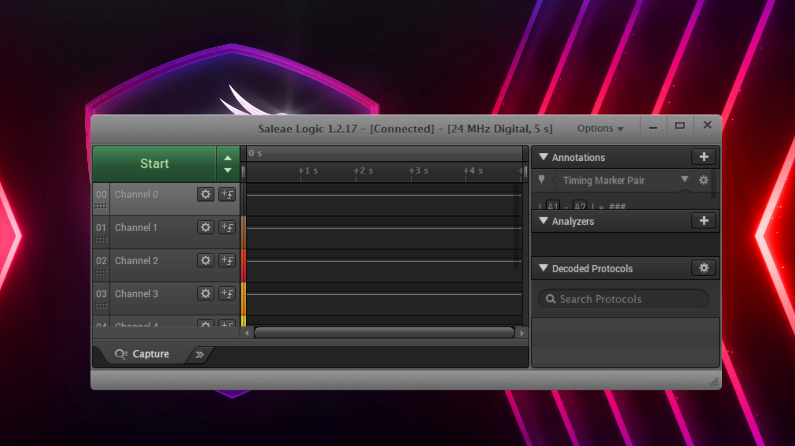
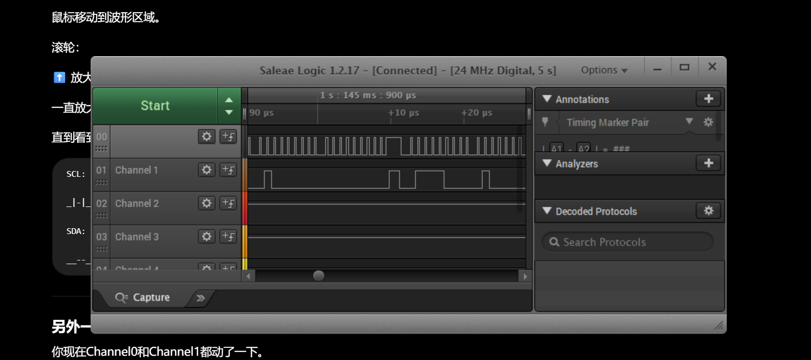
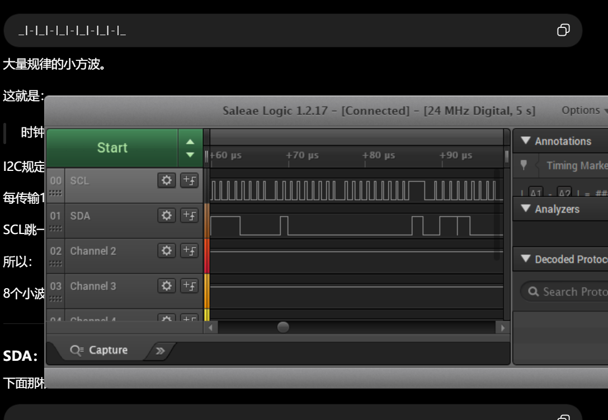
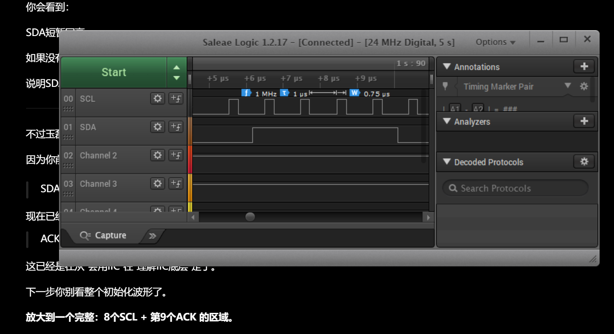
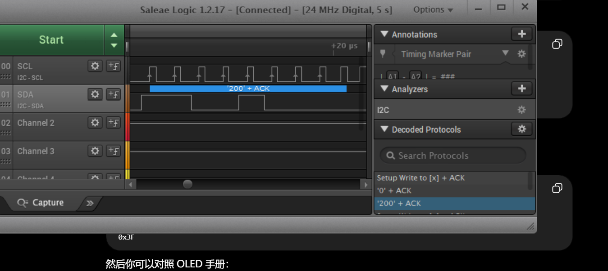
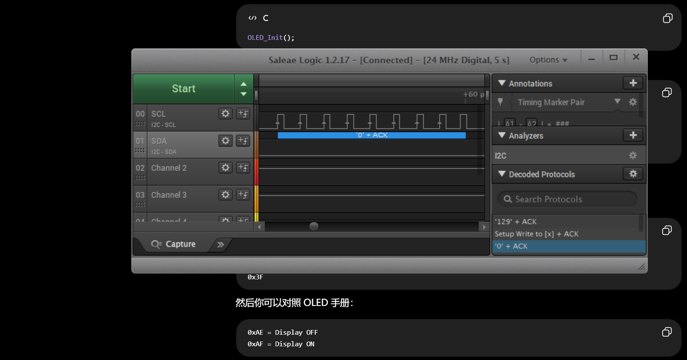

# Day23_I2C_OLED_Logic_Analyzer

## 1. Learning Objectives

本次实验的学习目标：

- 理解 **I2C communication protocol** 的基本通信流程。
- 使用 **Saleae Logic Analyzer** 观察 **SCL** 与 **SDA** 数字波形。
- 识别并分析 **START**、**ACK** 与 **STOP** 条件。
- 将 `OLED_Init()` 等上层函数调用与底层 I2C 时序对应起来。

## 2. Hardware Environment

- **STM32F103C8T6**
- **OLED I2C Display**
- **Saleae Logic Analyzer**
- **J-Link**

本工程的软件 I2C 引脚定义为：

- `PA6` → `SCL`
- `PA7` → `SDA`
- STM32 `GND` → Logic Analyzer `GND`

Logic Analyzer 和 STM32 必须共地。

## 3. Experiment Process

1. 使用 J-Link 下载并运行 Keil 工程：
   `Code/OLED_Display/USER/LED.uvprojx`。
2. 将 Saleae Logic Analyzer 的 Channel 0 连接到 `SCL`，Channel 1 连接到 `SDA`。
3. 在 Saleae 中设置 Digital Capture，并将采样率配置为 `24 MHz`。
4. 添加 **I2C Analyzer**：
   - Clock channel: Channel 0 / `SCL`
   - Data channel: Channel 1 / `SDA`
5. 启动采集后复位 STM32，捕获 `OLED_Init()` 产生的初始化通信。
6. 放大波形，分别检查 START、8-bit DATA、第 9 个时钟 ACK 和 STOP。

OLED 与软件 I2C 相关实现位于：
`Code/OLED_Display/HARDWARE/OLED/`。







## 4. I2C Protocol Analysis

**START**

当 `SCL` 保持高电平时，`SDA` 从高电平变为低电平，表示一次 I2C transaction 开始。

**ACK**

发送方完成 8-bit DATA 后释放 `SDA`，接收方在第 9 个 clock cycle 将 `SDA` 拉低，表示 **ACK**。如果第 9 个时钟期间 `SDA` 保持高电平，则表示 **NACK**。



**STOP**

当 `SCL` 保持高电平时，`SDA` 从低电平变为高电平，表示本次 I2C transaction 结束。

## 5. Analysis Result

OLED driver 使用 `0x78` 作为包含 Write bit 的 8-bit address，对应 Saleae 中的 7-bit device address `0x3C`。命令写入流程为：

```text
START
0x3C (Write) + ACK
0x00         + ACK
Command      + ACK
STOP
```

OLED 初始化阶段可以对应到以下典型解析结果：

```text
0x3C + ACK
0x00 + ACK
0xAE + ACK
0xAF + ACK
```

- `0x3C`：OLED 7-bit I2C address。
- `0x00`：Control Byte，表示后续字节为 command。
- `0xAE`：Display OFF。
- `0xAF`：Display ON。

Saleae 的显示进制会影响界面文本。例如截图中的 decimal `200` 对应 hexadecimal `0xC8`，decimal `129` 对应 hexadecimal `0x81`。分析时应与 `OLED_Init()` 中的 command sequence 对照。





## 6. Learning Summary

本次实验完成了从调用 OLED library functions 到理解底层 I2C communication process 的转换：

```text
OLED_Init()
    ↓
I2C START
    ↓
Device Address
    ↓
8-bit DATA + ACK
    ↓
I2C STOP
```

通过 Saleae Logic Analyzer，可以把程序中的 `IIC_Start()`、`Write_IIC_Byte()`、`IIC_Wait_Ack()` 和 `IIC_Stop()` 与真实的 SCL/SDA 波形对应起来。学习重点不再只是“OLED 能够显示”，而是理解 STM32 如何按照 I2C protocol 将 address、control byte 和 command 逐位发送到 OLED。
