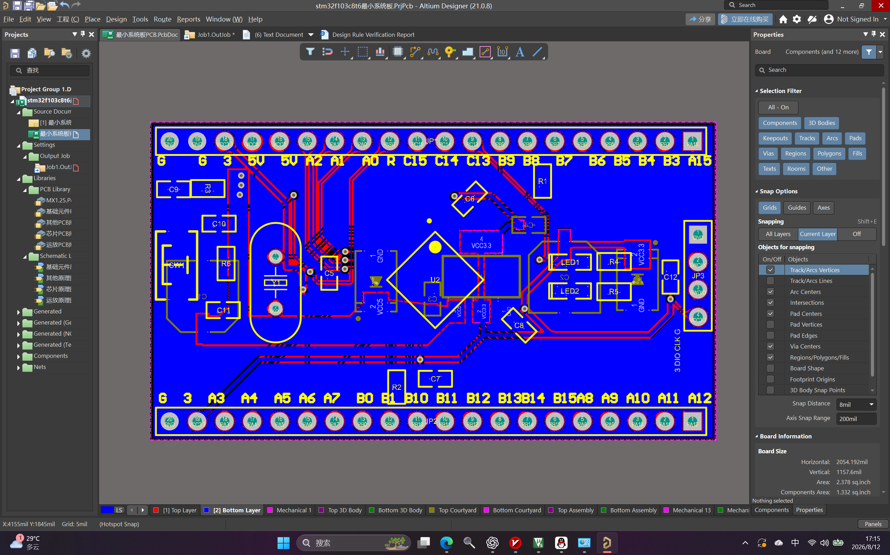

# Day30_STM32F103C8T6_Minimum_System_PCB_Design

## 1. 今日学习内容

今天是 STM32 100Days 的 Day30，继续学习第 2 章“硬件基本功：电路设计及制造”。

今天完成了：

- 第 2 节：Altium Designer 软件与工程环境。
- 第 3 节：STM32F103C8T6 最小系统板绘制完整流程。
- 创建 Altium Designer PCB 工程。
- 绘制 STM32F103C8T6 最小系统板原理图。
- 使用原理图库和 PCB 封装库。
- 将原理图更新到 PCB。
- 完成元件布局、双层布线、铺铜和丝印补充。
- 运行 DRC 并导出 Gerber、NC Drill 生产文件。

第 4 节打板和第 5 节焊接暂时保留到开学后，在宿舍具备合适场地、工具和时间后继续完成。

## 2. 学习目标

本次学习的目标不是立即独立设计一块商业级开发板，而是先走通完整流程：

```text
创建 PCB 工程
  ↓
绘制原理图
  ↓
调用或创建元件库
  ↓
更新到 PCB
  ↓
元件布局
  ↓
布线与铺铜
  ↓
DRC 检查
  ↓
导出 Gerber 和钻孔文件
```

## 3. 项目成果

本项目包含：

```text
Day30_STM32F103C8T6_Minimum_System_PCB_Design/
├── .gitignore
├── README.md
├── Douyin_Voiceover.md
├── Images/
│   └── pcb-layout.png
├── Manufacturing/
│   └── 最小系统板GERBER.zip
└── Project/
    ├── stm32f103c8t6最小系统板.PrjPcb
    ├── 最小系统板原理图.SchDoc
    └── 最小系统板PCB.PcbDoc
```

说明：为了保证 Altium Designer 工程引用完整，项目内部保留了原始中文文件名；GitHub 外层目录仍遵循 `DayXX_English_Topic` 命名规则。项目使用到的元件和封装数据已经保存在 `.SchDoc` 与 `.PcbDoc` 中，原工程附带的通用元件库没有写入 `.PrjPcb` 引用，因此不作为项目运行依赖上传。

## 4. PCB 内容

本次最小系统板设计包含或涉及：

- STM32F103C8T6 MCU。
- 外部晶振电路。
- 复位和 BOOT 配置。
- 电源与去耦电容。
- LED 指示电路。
- SWD 下载调试接口。
- GPIO 引出排针。
- 双层 PCB 布线和 GND 铺铜。
- 元件位号、接口名称和引脚丝印。



## 5. DRC 与丝印说明

本次 DRC 中以下关键电气项目为 0 违规：

- Clearance Constraint。
- Short-Circuit Constraint。
- Un-Routed Net Constraint。
- Width Constraint。
- Hole Size Constraint。

报告中仍存在部分 `Silk To Solder Mask` 间距提示。按照当前课程说明，这些丝印提示在本阶段不要求处理，因此本次没有继续逐项消除，并重新补充了接口和引脚丝印用于学习与识别。

这表示本次成果达到的是：

> 已跟随课程走通原理图、PCB 和生产文件导出流程。

但它还不能直接等同于：

> 已完成下单、焊接、上电和功能验证。

## 6. 当前掌握程度

| 内容 | 当前程度 | 证据 | 下一验收 |
|---|---|---|---|
| Altium Designer 工程创建 | 会做 | 已生成 `.PrjPcb` 工程 | 能脱离课程独立创建新工程 |
| 原理图绘制 | 练习中 | 已生成 `.SchDoc` | 能解释各子电路作用并完成 ERC 检查 |
| 元件库与封装 | 练习中 | 项目文档中已保存所用元件和封装 | 独立创建一个元件及其封装 |
| PCB 布局与布线 | 练习中 | 已完成 `.PcbDoc` | 能解释布局、线宽、过孔和回流路径选择 |
| DRC 检查 | 会做基础操作 | 关键电气规则为 0 违规 | 能区分电气违规与丝印制造提示 |
| Gerber/钻孔导出 | 会做 | 已生成 Gerber 与 NC Drill | 下单前使用 Gerber Viewer 再次核对 |
| 打板与焊接 | 未开始 | 尚未下单和焊接 | 开学后完成实物板制作与上电测试 |

## 7. 今日总结

今天最大的进步，是第一次在 Altium Designer 中完整走通了 STM32F103C8T6 最小系统板从原理图到 PCB，再到 Gerber 生产文件的流程。

以前使用 STM32 开发板时，我更多关注程序、引脚和模块接线；今天开始从硬件设计的角度理解，一块开发板还需要电源、晶振、复位、BOOT、下载接口、去耦和 GPIO 引出等多个部分共同组成。

目前我能够跟随课程完成工程创建、原理图、PCB、DRC 和 Gerber 导出，但还没有完成真正的打板、焊接和上电验证。因此今天的成果应该记录为“完成设计流程练习”，而不是“最小系统板实物验证成功”。

## 8. 后续安排

### 最小系统板

- 第 4 节打板和第 5 节焊接延后到开学后。
- 下单前再次检查封装尺寸、极性、接口方向和 Gerber 预览。
- 焊接后按电源、复位、晶振、SWD、跑马灯的顺序逐级验证。

### 明天：恢复平衡小车调试

充电器到货后，先恢复供电系统，不直接修改 PID 参数：

```text
确认充电器与电池匹配
  ↓
完成充电并检查极性、接头和裸露导体
  ↓
电池只接 L298N
  ↓
加入 STM32 与 MPU，暂不接电机
  ↓
接入电机并悬空车轮
  ↓
确认系统不掉电、MPU通信正常、轮向正确
  ↓
只开启直立环，先调 Kp，再加入 Kd
```

调参时继续遵守：速度环关闭、`Ki = 0`、每次只改一个参数，并记录参数、现象和输出是否达到限幅。

## 9. GitHub 说明

- 仓库保留 Altium 工程、原理图、PCB、Gerber 压缩包和成果截图。
- 原工程附带的通用 `.SchLib`、`.PcbLib` 体积较大，且没有被当前 `.PrjPcb` 引用，因此未收入 GitHub 发布目录；源工程中的库仍完整保留。
- 源工程根目录中的 `History`、预览、项目日志以及重复的中间输出没有收入发布目录；Gerber 压缩包保持原始导出内容。
- 建议使用 Altium Designer 21 或兼容版本打开 `Project/stm32f103c8t6最小系统板.PrjPcb`。
- 正式下单前仍应由 Gerber Viewer 复核板框、层、钻孔、阻焊、丝印和封装方向。
