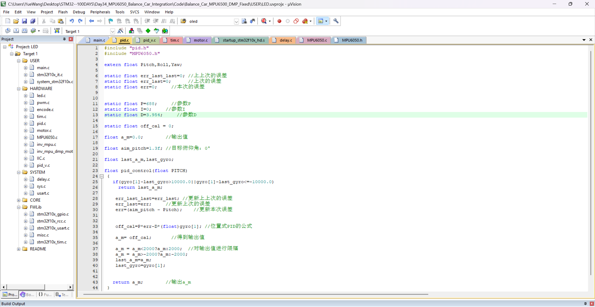

# Day35_Balance_Car_Upright_PD_Serial_Tuning

## 今日内容

今天继续调试 STM32F103 两轮平衡小车的直立环，在 MPU6050、DMP、软件 I2C、电机方向均已验证的基础上，重点完成了串口遥测与多轮 PD 参数实验。

本日目标不是直接加入速度环，而是先让直立环具备基本的纠偏和短时间直立能力，并通过数据判断 `P`、`D` 和目标平衡角的影响。

## 硬件与工具

- STM32F103C8T6
- MPU6050，`WHO_AM_I = 0x68`
- L298N 电机驱动
- 两路直流减速电机
- J-Link
- USB-TTL，115200、8N1、无流控
- Keil MDK
- 串口助手

## 串口接线

- STM32 `PA9 / USART1_TX` → USB-TTL `RX`
- STM32 `GND` → USB-TTL `GND`
- 需要向 STM32 发送在线命令时：STM32 `PA10 / USART1_RX` ← USB-TTL `TX`
- STM32 已由小车电源供电时，不连接 USB-TTL 的 VCC

## 今日修改

在实际用于小车测试的工程中增加了 20 Hz 串口遥测，持续输出：

```text
DATA,pitch,gyro,pid,ccr1/ccr2/ccr3/ccr4
```

重点观察：

- `pitch`：当前俯仰角
- `gyro[1]`：Y 轴角速度原始值
- `pidp`：直立环输出，限幅为 `-2000～2000`
- `TIM4->CCR1～CCR4`：左右电机方向与 PWM 输出

串口打印位于主循环，没有放入 5 ms 控制中断，避免改变直立环的执行周期。

## 调试过程

调试记录采用“现象 → 测试 → 观察 → 结论”的方式：

1. 初始参数下，小车出现大幅往复摆动。
2. 串口数据显示 `Pitch` 快速跨越目标角，`pidp` 长时间达到 `±2000`，四路 PWM 多次达到约 `1400`。
3. 逐步改变 `P` 和 `D`，对比角度范围、角速度、PID输出与实物动作。
4. 参数较小时，小车纠偏能力不足；参数较大时，输出容易饱和并形成明显振荡。
5. 最终找到一组能够让小车短时间保持直立、但仍会围绕直立位置往复摇摆的参数。

## 当前参数

```c
static float P = 688;
static float I = 0;
static float D = 3.954;
float aim_pitch = 1.3f;
```

这组参数是当前实验结果，不代表已经完成最终整定。

## 当前实验现象

已确认：

- MPU6050 与 DMP 数据能够持续更新。
- 两个电机能够同步纠偏。
- 小车已经具备短时间直立能力。
- 偏离目标角后，车轮会主动追赶车身重心。

仍存在：

- 小车不能一直保持稳定直立。
- 车身会围绕平衡位置持续往复摇摆。
- 仅凭肉眼难以准确比较每组参数的超调量、周期和衰减速度。
- 速度环尚未重新加入，本日现象主要来自直立环。

因此目前应将直立环状态判断为：**基本可用，仍需用曲线继续整定**。

## Ozone 调试计划

明天计划尝试使用 Ozone 同时观察：

- `Pitch`
- `gyro[1]`
- `pidp`
- `TIM4->CCR1～CCR4`

重点比较以下指标：

1. 角度偏离目标值后的最大超调量。
2. 往复摆动的周期是否固定。
3. 摆动幅度是否逐渐衰减。
4. PID输出进入 `±2000` 限幅的持续时间。
5. 增大或减小 `D` 后，角速度峰值是否下降。

Ozone主要用于变量监控、曲线记录和数据对比，本身不会自动给出一组必然正确的 PID 参数；它的价值是让调参从“凭感觉”变成“看曲线、有证据地调整”。

## 工程说明

本目录保留两个版本：

- `Code/Balance_Car_Upright_PD_Final`：今天实际测试工程的干净快照，包含当前参数与串口遥测。
- `Code/Balance_Car_MPU6050_PD_Serial_Tuning`：串口在线修改参数的实验版本，包含 `P/D/A/RUN/STOP/STATUS` 等命令。

Keil 工程入口：

```text
Code/Balance_Car_Upright_PD_Final/USER/LED.uvprojx
```

最终快照复制前已使用 Keil 完整编译：`0 errors，4 warnings`。GitHub 版本未保留 `OBJ`、`.axf`、`.hex`、`.map`、`.lst` 和调试日志等生成文件。

## Learning Summary

今天最大的进步不是获得了一组“神奇参数”，而是建立了可以重复验证的调参流程：修改参数、下载程序、串口采集、观察角度与输出，再根据数据继续调整。

直立环已经从完全无法站立推进到能够短时间直立。下一步需要借助 Ozone 记录曲线，继续压缩摆动幅度；直立环稳定后，再恢复速度环并处理小车位置漂移。


